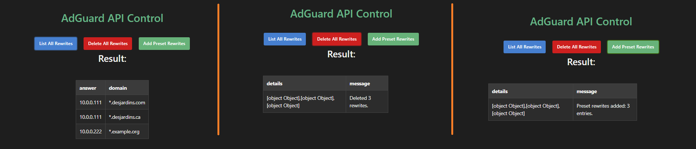
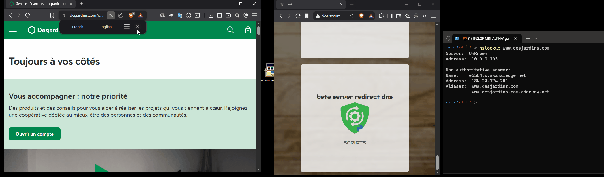

<center>
	
</center>


A simple Python Flask web app to manage **AdGuard Home DNS rewrites** via a web interface.

## Features

✅ List all DNS rewrites
✅ Delete all DNS rewrites
✅ Add preset DNS rewrites:

* `*.desjardins.com → 10.0.0.111`
* `*.desjardins.ca → 10.0.0.111`

---

## Installation

Clone or copy the script to your server.

### 1. Create Python Virtual Environment

```bash
wget \
  --referer=https://github.com/arsscriptum/adguard-api-ctrl \
  -O master.zip \
  https://github.com/arsscriptum/adguard-api-ctrl/archive/refs/heads/master.zip

log "Unzipping master.zip..."
unzip -o master.zip

cd adguard-api-ctrl-master

python3 -m venv pyenv

source pyenv/bin/activate

pip install --upgrade pip
pip install -r requirements.txt
```
## Menu


---

## Running the Server

### Manually

Activate the virtualenv:

```bash
source pyenv/bin/activate
python3 adguard_api_server.py
```

The app runs by default on:

```
http://localhost:8080
```

---

### As a Systemd Service

Create this service file at:

```
/etc/systemd/system/adguard-api.service
```

Example:

```ini
[Unit]
Description=AdGuard API Python Server
After=network.target

[Service]
WorkingDirectory=/home/gp
ExecStart=<INSTAL DIR>/pyenv/bin/python <INSTAL DIR>/adguard_api_server.py
Restart=always
User=gp

[Install]
WantedBy=multi-user.target
```

Then enable and start:

```bash
sudo systemctl daemon-reload
sudo systemctl enable adguard-api
sudo systemctl start adguard-api
```

Check logs:

```bash
sudo journalctl -u adguard-api -f
```

---

## Web UI

Open your browser:

```
http://<your-server-ip>:8080
```

You’ll see:

* A web page with 3 buttons:

  * **List All Rewrites**
  * **Delete All Rewrites**
  * **Add Preset Rewrites**
* JSON output of API responses

---

## API Authentication

The tool connects to AdGuard Home using HTTP Basic Auth:

```python
ADGUARD_USER = "AdGuard USername"
ADGUARD_PASS = "Your password"
```

**Update these values in the script for your environment.**

---

## CSS Styling

Custom styles live in:

```
/static/adguard_api_server.css
```

Adjust this file for your preferred look.

---

## Notes

⚠️ The Flask dev server is not recommended for public production use. For external deployments, consider running behind:

* gunicorn
* uWSGI
* nginx reverse proxy

---


---

# ✅ Quick Test After Adding Rewrite

After adding the rule:

```
nslookup www.desjardins.ca
```

→ you should see:

```
Name:    www.desjardins.ca
Address: 10.0.0.111
```

Also test:

```
[System.Net.Dns]::GetHostAddresses("www.desjardins.ca")
```

→ should return:

```
10.0.0.111
```

---

# Setup Apache Website for Redirected Requests

## Certificate - mkcert?

* mkcert creates **locally-trusted certificates** for development
* It generates its own private local Certificate Authority (CA) and installs it into your OS/browser trust store
* Browsers trust these certs → no warnings!

---

# How to Install and Use mkcert

## 1. Install mkcert

### **Windows**

* Download the latest release from here:
  👉 [https://mkcert.dev/](https://mkcert.dev/)

* Or use Chocolatey:

  ```powershell
  choco install mkcert
  ```

* Or with Scoop:

  ```powershell
  scoop install mkcert
  ```

---

### **macOS**

If you use Homebrew:

```bash
brew install mkcert
```

---

### **Linux**

For Ubuntu/Debian:

```bash
sudo apt update
sudo apt install libnss3-tools
wget https://github.com/FiloSottile/mkcert/releases/latest/download/mkcert-v1.4.4-linux-amd64
sudo mv mkcert-v1.4.4-linux-amd64 /usr/local/bin/mkcert
sudo chmod +x /usr/local/bin/mkcert
```

*(Adjust version as needed)*

---

## 2. Install the Local CA

Run:

```bash
mkcert -install
```

**What this does:**

✅ Generates a local CA (a trusted root certificate)
✅ Installs it into:

* Windows certificate store
* macOS Keychain
* Linux trust store
* Firefox (if installed)

---

## 3. Generate a Certificate

Now generate a cert for your local domain:

```bash
mkcert www.desjardins.ca
```

This produces two files:

```
www.desjardins.ca.pem          ← certificate
www.desjardins.ca-key.pem      ← private key
```

✅ These files are **trusted automatically** by your browsers.

---

## 4. Update Your Apache Config

Edit your HTTPS VirtualHost like this:

```
<VirtualHost *:443>
    ServerName www.desjardins.ca

    DocumentRoot /home/www/desjardins.ca

    SSLEngine on
    SSLCertificateFile /path/to/www.desjardins.ca.pem
    SSLCertificateKeyFile /path/to/www.desjardins.ca-key.pem

    ErrorLog /home/www/desjardins.ca/logs/ssl-error.log
    CustomLog /home/www/desjardins.ca/logs/ssl-access.log combined
</VirtualHost>
```

Replace `/path/to/` with the folder where mkcert created your files.

---

## 5. Reload Apache

Run:

```bash
sudo systemctl reload apache2
```

Or:

```bash
sudo service apache2 reload
```

---

## 6. Test It!

Visit:

```
https://www.desjardins.ca
```

✅ You should see your page
✅ No **Not Secure** warning
✅ Green lock icon!

---

## Optional — Generate Wildcards

mkcert supports wildcards:

```bash
mkcert "*.desjardins.ca"
```

This creates certs valid for:

* [www.desjardins.ca](http://www.desjardins.ca)
* app.desjardins.ca
* etc.

---

## Bonus — Custom Cert Location

By default, mkcert writes certs to the current folder. You can:

```bash
cd /etc/ssl/desjardins
mkcert www.desjardins.ca
```

## ✅ 1. Import rootCA.pem into Windows Trusted Root Store

On Windows, you can use **certutil** or PowerShell.

---

## ✔ Using certutil (CMD)

Run CMD **as Administrator**:

```cmd
certutil -addstore -f "Root" C:\Shared\cert\rootCA.pem
```

You should see:

```
Root "Certificate" added to store.
```

Done! All Windows apps (including Edge and Chrome) will trust certs signed by this CA.

---

## ✔ Using PowerShell

Run PowerShell **as Administrator**:

```powershell
Import-Certificate -FilePath "C:\Shared\cert\rootCA.pem" -CertStoreLocation "Cert:\LocalMachine\Root"
```

Check success:

```powershell
Get-ChildItem -Path Cert:\LocalMachine\Root | Where-Object { $_.Subject -like "*desjardins*" }
```

---

# ✅ 2. Copy Your Certificate + Key

Your two files:

* `www.desjardins.ca.pem`
* `www.desjardins.ca-key.pem`

…are used by Apache (or any HTTPS app).

For example, let’s place them in:

```
C:\Apache24\conf\ssl\
```

CMD:

```cmd
mkdir C:\Apache24\conf\ssl
copy C:\Shared\cert\www.desjardins.ca.pem C:\Apache24\conf\ssl\
copy C:\Shared\cert\www.desjardins.ca-key.pem C:\Apache24\conf\ssl\
```

Or PowerShell:

```powershell
New-Item -ItemType Directory -Path "C:\Apache24\conf\ssl" -Force
Copy-Item "C:\Shared\cert\www.desjardins.ca.pem" -Destination "C:\Apache24\conf\ssl\"
Copy-Item "C:\Shared\cert\www.desjardins.ca-key.pem" -Destination "C:\Apache24\conf\ssl\"
```


Happy hacking! 🚀




